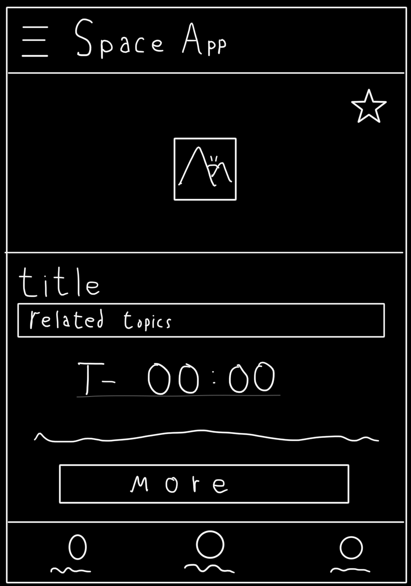
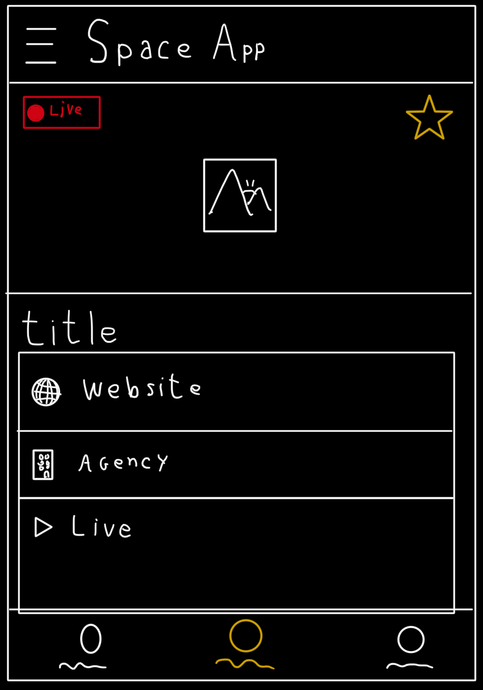

# Space-App
Aplicativo com informações de lançamentos e outros eventos espaciais.

## Futuras adições
Planejamos tornar a visualização dos posts mais dinâmica, de acordo com o conteúdo dos posts. Por exemplo, para lançamentos e missões em andamento pode ser exibido um timer com o tempo atual de missão. Em eventos com transmissão ao vivo, pode ser exibido um ícone para acessar o conteúdo em local externo ao aplicativo.

 

